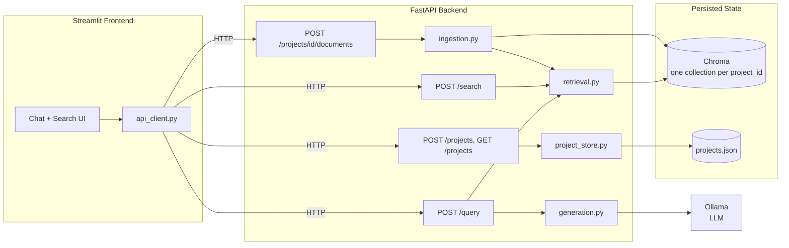

# SpecWise

A multi-project RAG assistant for software engineering documentation. Upload a project's docs (SRS, use cases, API specs) and ask natural-language questions — answers come back grounded in your own documents, with citations, and the system explicitly refuses to answer when something isn't covered rather than guessing.

Built as a graduation project (Core Track, text-only RAG). See [`SpecWise_Full_Final_Project_Plan.md`](./SpecWise_Full_Final_Project_Plan.md) for the full design rationale and build history.

## Overview

- **Create a project** for each system you're documenting (e.g. *Library Management System*, *E-Commerce Platform v2*).
- **Upload documents** — Markdown, plain text, or PDF. Each project gets its own isolated vector store; a question asked of one project never sees another project's documents.
- **Ask questions** and get an answer grounded in the retrieved chunks, with the source document and section cited.
- **Grounded refusal**: if the question isn't covered by the uploaded documents, the system says so instead of hallucinating.
- **Semantic search**: search a project's documents directly and get back the matching chunks, without generating an answer — useful for "find related requirements" style browsing.

## Architecture



Each project's documents live in their own Chroma collection (`project_{project_id}`), so retrieval for one project can never surface another project's chunks — this isolation is enforced in `retrieval.py` and covered by an explicit test (`tests/test_projects.py`).

## Tech Stack

| Layer                 | Technology                                                                                                   |
| --------------------- | ------------------------------------------------------------------------------------------------------------ |
| Notebook              | Jupyter,`sentence-transformers`, `chromadb`, `pypdf`                                                   |
| Backend               | FastAPI, Pydantic /`pydantic-settings`, ChromaDB, `sentence-transformers` (`all-MiniLM-L6-v2`), Ollama |
| Frontend              | Streamlit,`requests`, `python-dotenv`                                                                    |
| Dependency management | [`uv`](https://docs.astral.sh/uv/) (three independent projects — notebook, backend, frontend)              |
| Testing               | `pytest`, `httpx`, Streamlit's `AppTest`                                                               |
| Containerization      | Docker (`ghcr.io/astral-sh/uv` base image), `docker-compose`                                             |

## Project Structure

```
specwise-app/
├── notebooks/
│   └── rag_pipeline.ipynb        # Sections 2.1–2.6: load/inspect, chunking, embeddings
│                                    & vector store, retrieval & prompting, evaluation
├── backend/
│   ├── app/
│   │   ├── main.py                # FastAPI app, CORS, lifespan startup (loads vector
│   │   │                            store + embedding model ONCE, not per-request)
│   │   ├── api/routes/
│   │   │   ├── query.py           # POST /query, GET /health
│   │   │   ├── projects.py        # POST /projects, GET /projects
│   │   │   ├── documents.py       # POST /projects/{id}/documents
│   │   │   └── search.py          # POST /search
│   │   ├── core/config.py         # Env-driven settings
│   │   ├── schemas/                # QueryRequest/Response, Project*, Document*, Search*
│   │   ├── services/
│   │   │   ├── retrieval.py       # Per-project similarity search
│   │   │   ├── generation.py      # Prompt building, grounded refusal, Ollama call
│   │   │   ├── ingestion.py       # parse → clean → chunk → embed → store
│   │   │   └── project_store.py   # Persisted JSON project metadata registry
│   │   └── utils/logging_config.py
│   ├── data/vector_store/         # Persisted Chroma dir — gitignored, see below
│   ├── tests/                     # 14 pytest tests, incl. cross-project isolation check
│   ├── pyproject.toml / uv.lock
│   ├── .env.example
│   └── Dockerfile
├── frontend/
│   ├── app.py                     # Streamlit UI: project selector, upload, chat, search
│   ├── api_client.py              # All backend HTTP calls, consistent error handling
│   ├── pyproject.toml / uv.lock
│   ├── .env.example
│   └── Dockerfile
├── data/sample_project/           # Demo corpus: Library Management System (SRS, use
│                                     cases, API spec) — used throughout the notebook
├── docker-compose.yml             # backend + frontend + Ollama, one-command local run
├── .gitignore
└── README.md
```

## Domain & Sample Data

The demo/reference project throughout this repo is a **Library Management System** — three small Markdown documents under `data/sample_project/`:

- `SRS.md` — requirements, including §3.4 Reservation Rules, the worked example used to sanity-check retrieval
- `UseCases.md` — six use cases (register, search, borrow, reserve, return, pay fine)
- `API_Spec.md` — the corresponding REST endpoints

Replace these with your own project's real documentation to use SpecWise for anything else — nothing in the pipeline assumes this specific domain.

## Setup

> This section covers getting everything running. For backend-specific details (module architecture, full endpoint reference, design notes, troubleshooting) see [`backend/README.md`](./backend/README.md). For frontend-specific details see [`frontend/README.md`](./frontend/README.md). For a full step-by-step walkthrough with a verification checklist at every stage, see [`SETUP_AND_VERIFICATION_GUIDE.md`](./SETUP_AND_VERIFICATION_GUIDE.md).

### Prerequisites

- Python 3.10+
- [uv](https://docs.astral.sh/uv/)
- [Ollama](https://ollama.com), running locally with a model pulled (e.g. `ollama pull llama3.2`)

### 1. Build the vector store (notebook)

```bash
cd notebooks
uv init --name specwise-notebook   # first time only
uv add jupyter pandas numpy chromadb sentence-transformers pypdf ollama python-dotenv
uv run jupyter lab
```

Open `rag_pipeline.ipynb` and **Restart & Run All**. This populates `backend/data/vector_store/` with the demo project's embeddings — the backend loads this directory directly, no separate export step.

### 2. Backend

```bash
cd backend
uv sync --frozen
cp .env.example .env
uv run uvicorn app.main:app --reload
```

Swagger UI: `http://localhost:8000/docs`

### 3. Frontend

```bash
cd frontend
uv sync --frozen
cp .env.example .env
uv run streamlit run app.py
```

Opens at `http://localhost:8501`.

### Docker (alternative to steps 2–3)

```bash
docker compose up --build
```

Runs backend (`:8000`), frontend (`:8501`), and Ollama (`:11434`) together. You still need to run the notebook once beforehand (step 1) to populate `backend/data/vector_store/`, since it's bind-mounted into the backend container rather than baked into the image.

## Environment Variables

**Backend** (`backend/.env`, see `.env.example`)

| Variable                                       | Default                     | Purpose                                                                         |
| ---------------------------------------------- | --------------------------- | ------------------------------------------------------------------------------- |
| `VECTOR_STORE_DIR`                           | `./data/vector_store`     | Path to the persisted Chroma directory                                          |
| `DEFAULT_PROJECT_ID`                         | `library_management_demo` | Fallback collection when a request omits`project_id`                          |
| `PROJECT_REGISTRY_PATH`                      | `./data/projects.json`    | Where project metadata is persisted                                             |
| `EMBEDDING_MODEL_NAME`                       | `all-MiniLM-L6-v2`        | Must match the model used to build the vector store                             |
| `TOP_K`                                      | `4`                       | Chunks retrieved per query                                                      |
| `DISTANCE_THRESHOLD`                         | `0.75`                    | Grounded-refusal cutoff — tune empirically, see the notebook's Phase 3 section |
| `CHUNK_SIZE_WORDS` / `CHUNK_OVERLAP_WORDS` | `400` / `60`            | Used by`ingestion.py` for newly uploaded documents                            |
| `OLLAMA_MODEL`                               | `llama3.2`                | Model used for generation                                                       |
| `OLLAMA_HOST`                                | `http://localhost:11434`  | Set to`http://ollama:11434` under docker-compose                              |
| `LOG_LEVEL`                                  | `INFO`                    |                                                                                 |
| `CORS_ORIGINS`                               | `http://localhost:8501`   | Comma-separated list                                                            |

**Frontend** (`frontend/.env`, see `.env.example`)

| Variable         | Default                   | Purpose                                                        |
| ---------------- | ------------------------- | -------------------------------------------------------------- |
| `API_BASE_URL` | `http://localhost:8000` | Backend URL — never hard-coded in`app.py`/`api_client.py` |

## API Reference

### `GET /health`

```bash
curl http://localhost:8000/health
```

### `POST /query`

```bash
curl -X POST http://localhost:8000/query \
  -H "Content-Type: application/json" \
  -d '{"question": "Can a member reserve a book that is already checked out?"}'
```

`project_id` is optional — omit it to use `DEFAULT_PROJECT_ID`. Response:

```json
{
  "answer": "Yes, per SRS §3.4, a member may reserve a checked-out book...",
  "sources": [{"doc_name": "SRS.md", "section": "3.4 Reservation Rules"}],
  "refused": false
}
```

### `POST /projects`

```bash
curl -X POST http://localhost:8000/projects \
  -H "Content-Type: application/json" \
  -d '{"name": "E-Commerce Platform v2", "description": "Sample second project"}'
```

### `GET /projects`

```bash
curl http://localhost:8000/projects
```

### `POST /projects/{project_id}/documents`

```bash
curl -X POST http://localhost:8000/projects/<project_id>/documents \
  -F "file=@./data/sample_project/SRS.md"
```

### `POST /search`

```bash
curl -X POST http://localhost:8000/search \
  -H "Content-Type: application/json" \
  -d '{"question": "reservation rules", "project_id": "<project_id>"}'
```

Returns ranked chunks directly, no generation:

```json
{"results": [{"doc_name": "SRS.md", "section": "3.4 Reservation Rules", "text": "...", "distance": 0.12}]}
```

## Evaluation

The full evaluation methodology and results table live in `notebooks/rag_pipeline.ipynb`, Section 2.6. Twelve test questions span the categories called for in the project plan: direct factual, conceptual, multi-document, difficult/paraphrased retrieval, and unanswerable (grounded refusal).

Every row is judged on two **separate** axes rather than one correct/incorrect column:

- **Context relevant** — did retrieval find the right chunk?
- **Grounded** — is the generated answer actually supported by what was retrieved (not hallucinated)?

> Run the notebook top-to-bottom, fill in the judgment columns as described in Section 2.6, then update this section with your actual results — e.g.:
>
> | Category               | Questions | Context relevant | Grounded              |
> | ---------------------- | --------- | ---------------- | --------------------- |
> | Direct factual         | 3         | _/3              | _/3                   |
> | Conceptual             | 2         | _/2              | _/2                   |
> | Multi-document         | 2         | _/2              | _/2                   |
> | Difficult retrieval    | 2         | _/2              | _/2                   |
> | Unanswerable (refusal) | 3         | n/a              | _/3 refused correctly |

See the notebook's failure-case-analysis section for what went wrong on any row that didn't pass, and which stage (retrieval vs. generation) was responsible.

## Testing

```bash
cd backend
uv run pytest -v
```

14 tests: happy-path and validation checks for `/query` and `/search`, project creation/listing, and — the single most important correctness check in the system — a cross-project isolation test that uploads different content to two projects and asserts their collections never mix.

## Regenerating the Vector Store

`backend/data/vector_store/` and `backend/data/projects.json` are gitignored — they're runtime state, not source. To regenerate:

1. Run `notebooks/rag_pipeline.ipynb` top-to-bottom (rebuilds `data/vector_store/` for the demo project).
2. Start the backend — `data/projects.json` is created automatically as you create projects through the API.
